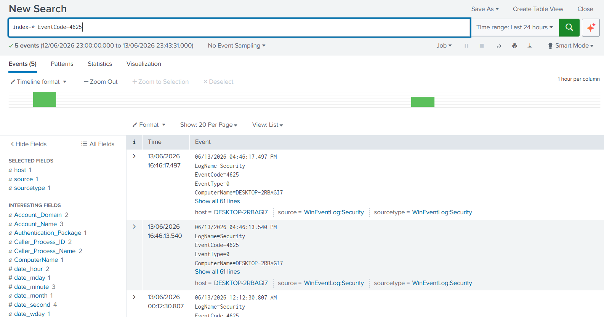
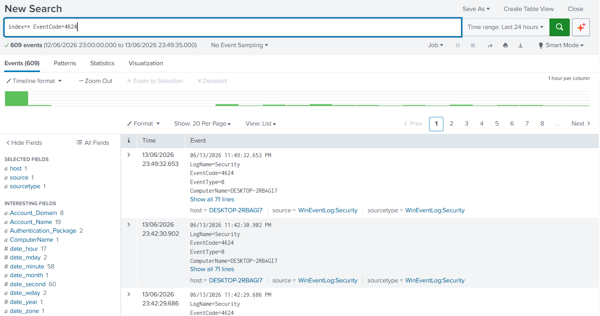
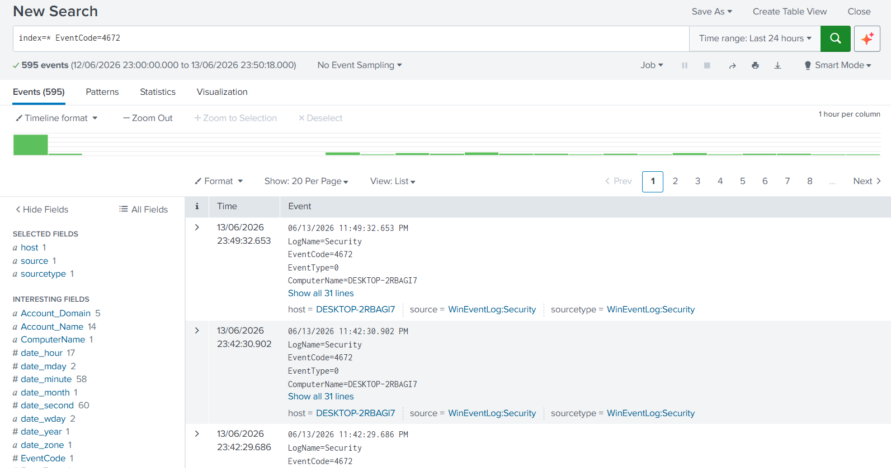
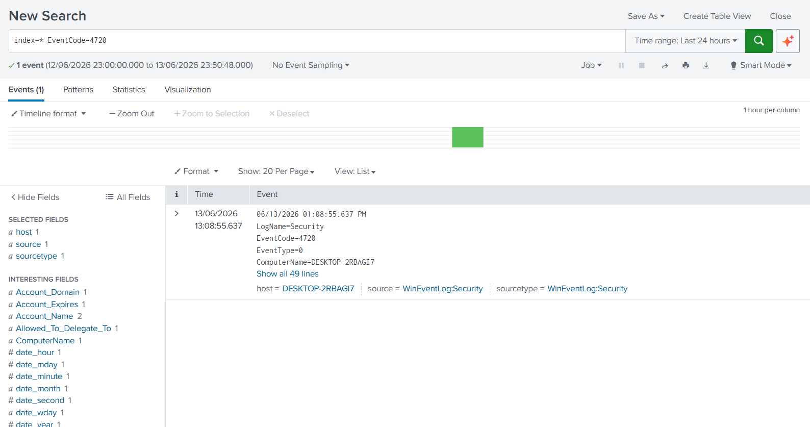
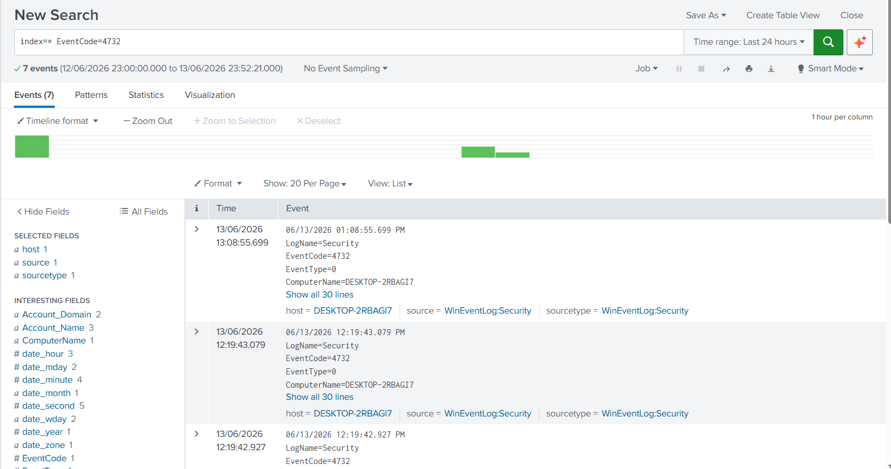

# Active Directory Security Lab

## Overview

This project demonstrates Active Directory security monitoring using Splunk Enterprise and Windows Security Event Logs.

The objective of this lab is to monitor authentication activity, detect suspicious account behavior, identify privileged access events, track account management operations, and develop security detections aligned with the MITRE ATT&CK framework.

The lab simulates common SOC analyst monitoring scenarios and demonstrates how Splunk can be used to investigate Active Directory activity through Windows Security Events.

---

## Environment

| Component  | Details                |
| ---------- | ---------------------- |
| SIEM       | Splunk Enterprise 10.4 |
| Endpoint   | Windows 11             |
| Log Source | WinEventLog:Security   |
| Framework  | MITRE ATT&CK           |

---

## Detection Use Cases

This lab includes the following Active Directory monitoring use cases:

* Failed Logons (Event ID 4625)
* Successful Logons (Event ID 4624)
* Privileged Logons (Event ID 4672)
* User Account Creation (Event ID 4720)
* Group Membership Changes (Event ID 4732)

---

## Detection Documentation

Detailed detection write-ups are available in the `detections/` directory:

* [Failed Logons](detections/failed_logons.md)
* [Successful Logons](detections/successful_logons.md)
* [Privileged Logons](detections/privileged_logons.md)
* [User Account Creation](detections/user_account_creation.md)
* [Group Membership Changes](detections/group_membership_changes.md)

---

## Detection 1 – Failed Logons

### Objective

Detect failed authentication attempts that may indicate password guessing, brute-force activity, or unauthorized access attempts.

### SPL Query

```spl
index=* EventCode=4625
```

### MITRE ATT&CK

| Technique ID | Technique   |
| ------------ | ----------- |
| T1110        | Brute Force |

### Evidence



---

## Detection 2 – Successful Logons

### Objective

Monitor successful authentication events and identify valid account usage across the environment.

### SPL Query

```spl
index=* EventCode=4624
```

### MITRE ATT&CK

| Technique ID | Technique      |
| ------------ | -------------- |
| T1078        | Valid Accounts |

### Evidence



---

## Detection 3 – Privileged Logons

### Objective

Detect logon sessions that receive elevated privileges and administrative rights.

### SPL Query

```spl
index=* EventCode=4672
```

### MITRE ATT&CK

| Technique ID | Technique      |
| ------------ | -------------- |
| T1078        | Valid Accounts |

### Evidence



---

## Detection 4 – User Account Creation

### Objective

Detect creation of new user accounts that may indicate unauthorized account provisioning or persistence mechanisms.

### SPL Query

```spl
index=* EventCode=4720
```

### MITRE ATT&CK

| Technique ID | Technique      |
| ------------ | -------------- |
| T1136        | Create Account |

### Evidence



---

## Detection 5 – Group Membership Changes

### Objective

Detect modifications to security group membership that may indicate privilege escalation or account manipulation.

### SPL Query

```spl
index=* EventCode=4732
```

### MITRE ATT&CK

| Technique ID | Technique            |
| ------------ | -------------------- |
| T1098        | Account Manipulation |

### Evidence



---

## Detection Summary

| Detection                | Event ID | Status    |
| ------------------------ | -------- | --------- |
| Failed Logons            | 4625     | Validated |
| Successful Logons        | 4624     | Validated |
| Privileged Logons        | 4672     | Validated |
| User Account Creation    | 4720     | Validated |
| Group Membership Changes | 4732     | Validated |

---
## Findings

During this lab, multiple Active Directory security events were successfully monitored and analyzed using Splunk Enterprise.

Key findings included:

* Failed authentication attempts were identified through Event ID 4625 monitoring.
* Successful logon activity was validated using Event ID 4624.
* Privileged account logons were detected through Event ID 4672.
* User account creation events were successfully monitored using Event ID 4720.
* Security group membership modifications were identified through Event ID 4732.
* Windows Security Event Logs provided detailed visibility into authentication and account-management activity.
* Splunk SPL searches enabled rapid detection and investigation of Active Directory security events.

---

## Repository Structure

```text
Active-Directory-Security-Lab
│
├── README.md
│
├── detections
│   ├── failed_logons.md
│   ├── successful_logons.md
│   ├── privileged_logons.md
│   ├── user_account_creation.md
│   └── group_membership_changes.md
│
└── screenshots
    ├── failed_logons.png
    ├── successful_logons.png
    ├── privileged_logons.png
    ├── user_account_creation.png
    └── group_membership_changes.png
```

---

## Detection Documentation

Detailed detection write-ups are available in the `detections` directory:

* Failed Logons Detection
* Successful Logons Detection
* Privileged Logons Detection
* User Account Creation Detection
* Group Membership Changes Detection

```
```


## Repository Structure

```text
Active-Directory-Security-Lab
│
├── README.md
│
├── detections
│   ├── failed_logons.md
│   ├── successful_logons.md
│   ├── privileged_logons.md
│   ├── user_account_creation.md
│   └── group_membership_changes.md
│
└── screenshots
    ├── failed_logons.png
    ├── successful_logons.png
    ├── privileged_logons.png
    ├── user_account_creation.png
    └── group_membership_changes.png
```

---

## Skills Demonstrated

* Active Directory Security Monitoring
* Windows Security Event Log Analysis
* Splunk SPL Development
* Detection Engineering
* Authentication Monitoring
* Privileged Access Monitoring
* User and Group Management Monitoring
* MITRE ATT&CK Mapping
* Security Operations Center (SOC) Workflow
* Blue Team Analysis

---

## Key Takeaways

* Windows Security Event Logs provide critical visibility into authentication and account-management activity.
* Splunk enables efficient monitoring and investigation of Active Directory events.
* Detection engineering helps transform raw event data into actionable security monitoring use cases.
* MITRE ATT&CK mapping improves detection coverage tracking and documentation.
* Active Directory monitoring remains a core capability for SOC analysts and blue teams.

---

## Author

**Agata Gabara**

Cybersecurity Analyst | SOC Analyst | Threat Hunter

GitHub: https://github.com/ag48665
